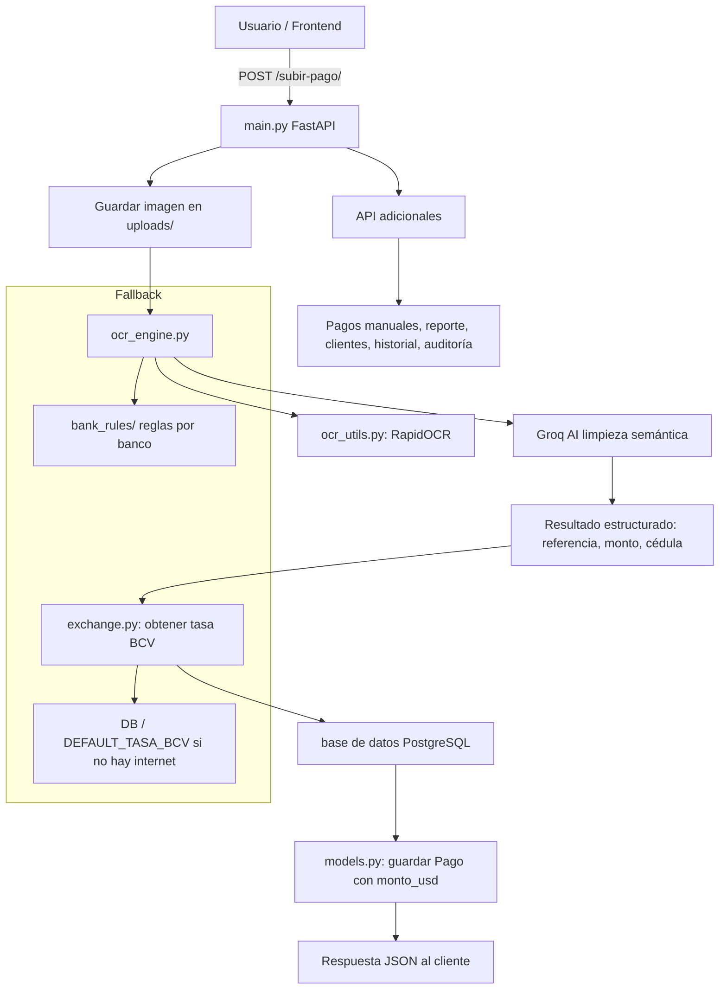

# Diagrama de flujo del sistema de conciliación de pagos

Este documento contiene el diagrama de flujo del proceso principal del sistema. Puedes descargarlo directamente desde el proyecto.

## Diagrama de flujo

## Descripción breve

- `main.py`: recibe la imagen y orquesta el proceso.
- `ocr_engine.py`: ejecuta RapidOCR y limpia los datos con Groq.
- `ocr_utils.py`: extrae texto de la imagen localmente.
- `exchange.py`: obtiene la tasa BCV y convierte el monto a USD.
- `models.py`: persiste el pago en la base de datos.
- `bank_rules/`: fallback de detección de banco cuando la IA no es concluyente.

## Cómo usarlo

1. Abre este archivo en VS Code.
2. Si tienes la extensión de Mermaid, podrás ver el diagrama renderizado.
3. También puedes copiar el bloque Mermaid a un editor online compatible o usar una herramienta de conversión a imagen.
